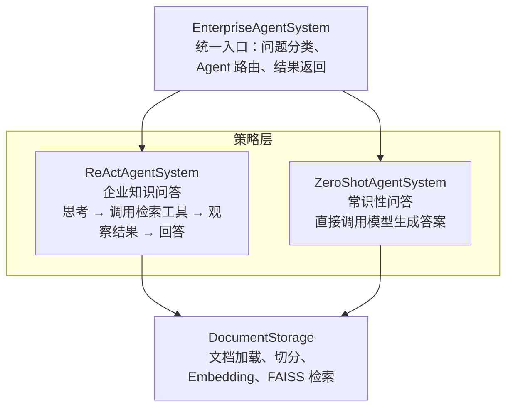

```mermaid
flowchart TD
    A[EnterpriseAgentSystem<br/>统一入口：问题分类、Agent 路由、结果返回]

    subgraph 策略层
        B[ReActAgentSystem<br/>企业知识问答<br/>思考 → 调用检索工具 → 观察结果 → 回答]
        C[ZeroShotAgentSystem<br/>常识性问答<br/>直接调用模型生成答案]
    end

    D[DocumentStorage<br/>文档加载、切分、Embedding、FAISS 检索]

    A --> B
    A --> C
    B --> D
    C --> D
```